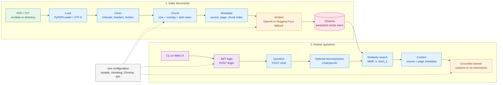

## Document RAG

This project loads PDF and plain-text files, cleans extracted text, recursively
chunks it, stores embeddings in persistent Chroma, retrieves relevant chunks,
and generates answers using OpenAI.

### What the project does

This is a retrieval-augmented generation (RAG) application for asking
document-grounded questions about engineering and quality records. Documents
are loaded from a file or directory, converted into searchable chunks, stored
in a persistent vector database, and retrieved as context for each answer.

The application supports:

- PDF files, with one source document created per page
- Plain-text `.txt` files, with one source document created per file
- Recursive directory indexing
- Configurable text cleaning for headers, footers, watermarks, and replacements
- Source metadata in answers, including the source file and page when available
- A command-line interface and an authenticated FastAPI web API

### Processing flow

```text
PDF / TXT files
	|
	v
Document loading -> Text cleaning -> Recursive chunking
	|                   |                  |
	+-------------------+------------------+
			    v
		    Chroma vector database
			    |
			    v
		  Retrieval -> OpenAI answer
```

### System architecture



The vertical flow separates the indexing path from the question path. During
indexing, source files are parsed, cleaned, chunked, enriched with metadata,
embedded, and persisted in Chroma. During a question, the API authenticates the
user, optionally decomposes the query, retrieves relevant chunks, and sends
only that context to `ChatOpenAI` for a grounded response.

### Project structure

| Path | Purpose |
| --- | --- |
| `src/ingestion` | Loads PDF and text source files |
| `src/preprocessing` | Normalizes and cleans extracted text |
| `src/chunking` | Splits documents into searchable chunks |
| `src/vectordb` | Stores and queries Chroma vectors |
| `src/reterieval` | Retrieves relevant chunks for a question |
| `src/generation` | Generates grounded answers with OpenAI |
| `src/project` | Provides the pipeline and CLI entry point |
| `src/api` | Serves the FastAPI backend and web interface |
| `src/data` | Example engineering and quality documents |
| `chroma_db` | Local persistent vector database |

### Setup

Install dependencies with `uv sync`, then configure `.env`:

```env
OPENAI_API_KEY=your-api-key
OPENAI_EMBEDDING_MODEL=your-embedding-model
OPENAI_CHAT_MODEL=your-chat-model
HF_EMBEDDING_MODEL=sentence-transformers/all-MiniLM-L6-v2
```

### Command line workflow

Run the indexing command only when you add or change source documents, cleaning rules,
chunking settings, or the embedding model. You do not need to run it for every
question.

For a fresh index, clear the old vectors and process all supported documents:

```powershell
uv run project index .\src\data --recursive --reset
```

Place supported PDF and text files in `src/data` or another directory. The
`--reset` option clears old vectors before building a fresh collection.

After indexing, start the API:

```powershell
uv run rag-api
```

Then open the chatbot:

```text
http://127.0.0.1:8000
```

For command-line questions, use:

```powershell
uv run project ask "What is the main topic?"
```

### Example questions

After indexing the documents, you can ask questions such as:

- What material is currently approved for the P104 pump housing?
- Why is Polymer Grade B being considered as a replacement?
- What are the highest risks of replacing Polymer Grade A with Polymer Grade B?
- What are the operating temperature and pressure requirements for P104?
- What validation tests are required before approving the material change?
- Why is extended thermal cycling required for Polymer Grade B?
- What happened during the previous CP-420 Polymer Grade B validation?
- Did Polymer Grade B pass pressure and vibration testing?
- What caused the historical housing cracks?
- What supplier-quality issue was found with Supplier-Z?
- What corrective actions did Supplier-Z implement?
- What inspections are required after coolant aging?
- What are the acceptance criteria for the P104 material-change validation?
- Is Polymer Grade B approved for the P104 housing yet?
- What evidence is required before the material change can be released?

The Chroma database is stored in `chroma_db/` and is ignored by Git.

### Retrieval evaluation

Use labeled questions to measure whether retrieval returns the expected source
documents. The evaluator counts each source file once, even when multiple
chunks from that file are returned.

```python
from evalution import RetrievalCase, evaluate_retrieval, summarize_retrieval
from project import RAGPipeline
from reterieval import retrieve

pipeline = RAGPipeline(persist_directory="chroma_db_staging")
cases = [
	RetrievalCase.from_sources(
		"What material is currently approved for the P104 pump housing?",
		["SPEC-P104-REV6.txt"],
	),
	RetrievalCase.from_sources(
		"What happened during the previous CP-420 Polymer Grade B validation?",
		["TR-1845_CP420_Thermal_Validation.txt", "FA-2218_CP420_Housing_Crack.txt"],
	),
]

scores = evaluate_retrieval(
	cases,
	lambda query, k: retrieve(
		query, pipeline.store, k=k, decompose=False, use_mmr=False
	).documents,
	k=4,
)
summary = summarize_retrieval(scores)
print(f"precision@4: {summary.mean_precision_at_k:.2%}")
print(f"recall@4: {summary.mean_recall_at_k:.2%}")
```

Precision@k is the fraction of the top `k` results that belong to an expected
source. Recall@k is the fraction of expected sources found in the top `k`.
Track these values on a fixed evaluation set whenever documents, chunking,
embeddings, or retrieval settings change.

### Scope of improvement

Retrieval quality can be improved incrementally and validated against the same
labeled evaluation set. Possible improvements include:

- **Re-indexing strategy:** Rebuild the Chroma collection after changing source
	documents, cleaning rules, chunk sizes, overlap, or embedding models. Keep
	separate collections for experiments so results from different index versions
	can be compared safely.
- **Chunking optimization:** Experiment with chunk size and overlap, and add
	structure-aware splitting for headings, tables, requirements, and numbered
	procedures instead of relying only on recursive character boundaries.
- **Embedding evaluation:** Compare embedding models using precision@k,
	recall@k, and retrieval latency. Use domain-specific or locally hosted
	embeddings when engineering terminology is not represented well by the
	default model.
- **Hybrid search:** Combine semantic vector search with keyword or BM25 search
	so exact identifiers, revision numbers, material grades, and part numbers are
	easier to find.
- **Reranking:** Retrieve a larger candidate set, then apply a cross-encoder or
	other reranker before selecting the final context. This can improve ordering
	when several chunks use similar language.
- **Query processing:** Expand abbreviations, normalize part and document IDs,
	and use query decomposition for multi-part questions. Query rewriting should
	preserve important identifiers and technical constraints.
- **Metadata and filtering:** Add metadata such as document type, revision,
	product, supplier, and approval status, then apply metadata filters before or
	during retrieval.
- **Context selection:** Deduplicate overlapping chunks, diversify results by
	source document, and use a relevance threshold so weak matches are excluded
	from the answer context.
- **Evaluation and monitoring:** Add labeled cases for exact lookup, comparison,
	multi-document reasoning, and no-answer questions. Track precision@k,
	recall@k, answer faithfulness, citation correctness, latency, and index size
	across every retrieval configuration.

The safest workflow is to create a fresh staging collection, re-index the same
dataset with one change at a time, run the retrieval evaluator, and promote the
configuration only when it improves the target metrics without introducing
unsupported sources or unacceptable latency.

### Configuration

The application reads settings from `.env`. `OPENAI_API_KEY` is required for
OpenAI embeddings or answer generation. `HF_EMBEDDING_MODEL` is used by the
local Hugging Face embedding configuration when selected. Chroma data is
stored in `CHROMA_PERSIST_DIRECTORY` when that setting is provided; otherwise
the default directory is `chroma_db`.

`CHUNK_SIZE` controls the maximum number of characters in each chunk and
`CHUNK_OVERLAP` controls how much neighboring chunks overlap. The defaults are
`1200` and `200`. Re-index the documents after changing either value:

```powershell
uv run project index .\src\data --recursive --reset
```

### API

Add `AUTH_USERNAME`, `AUTH_PASSWORD`, and a long random `JWT_SECRET_KEY` to
`.env`, then start the API:

```powershell
uv run rag-api
```

Login:

```powershell
Invoke-RestMethod http://127.0.0.1:8000/login -Method Post -ContentType 'application/json' -Body '{"username":"admin","password":"change-this-password"}'
```

Use the returned bearer token for chatbot requests:

```powershell
Invoke-RestMethod http://127.0.0.1:8000/chat -Method Post -Headers @{ Authorization = 'Bearer YOUR_TOKEN' } -ContentType 'application/json' -Body '{"question":"What is the main topic?","k":4}'
```

### Production readiness: volume and concurrency testing

Before production deployment, test the system with a representative document
collection and realistic concurrent users. Measure:

- Indexing time, memory usage, and Chroma database size as document volume grows
- Retrieval and answer-generation latency at the expected concurrency level
- Error rates, request timeouts, and OpenAI rate-limit behavior under load
- CPU and memory usage for the API and embedding workload
- Retrieval quality and citation correctness after indexing the full dataset

Run these tests in a staging environment with production-like infrastructure.
Increase document volume and concurrent requests gradually, record baseline
metrics, and define acceptable limits for latency, errors, and resource usage
before release. Do not run load tests against production until rate limits,
monitoring, and rollback procedures are in place.

